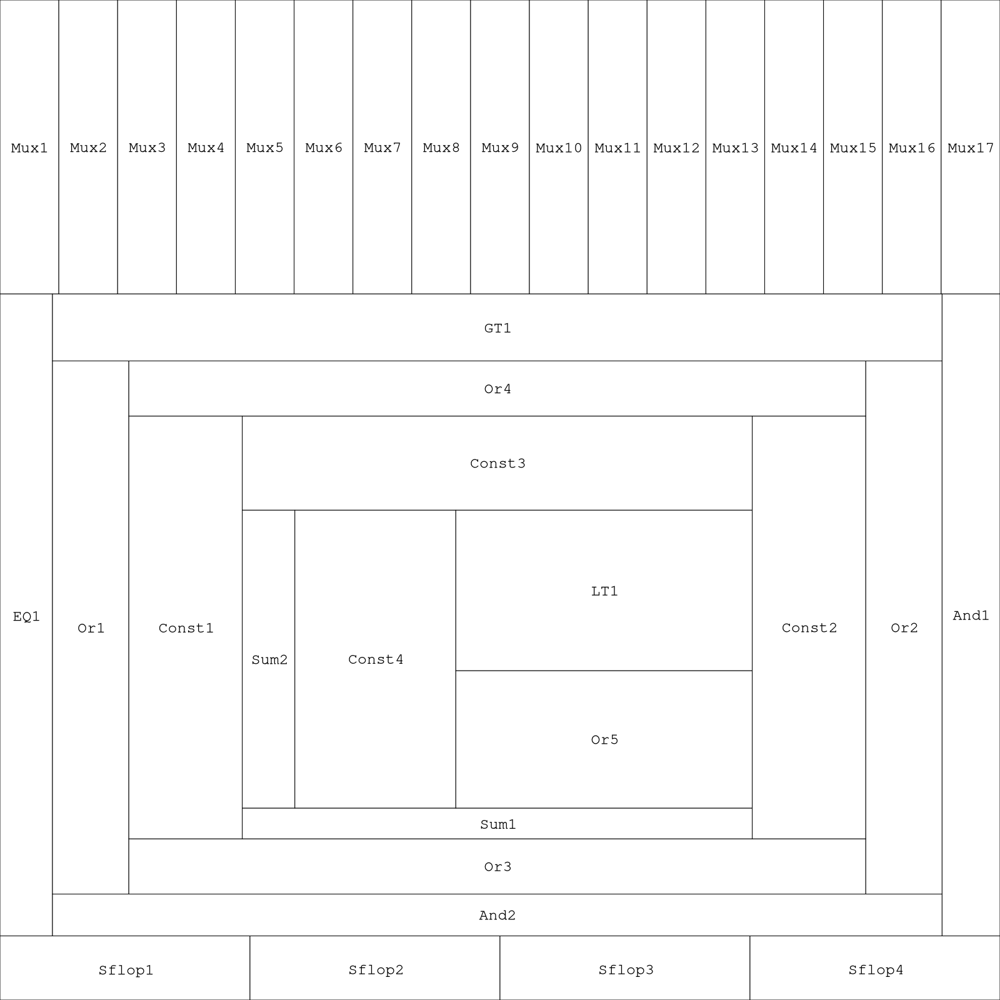

# fplan

fplan is a floorplanner that takes advantage of hierarchy and regularity in LiveHD designs.  It uses [ArchFP](http://lava.cs.virginia.edu/archfp/) to generate the actual floorplan files.

An example floorplan generated from [this](../../inou/yosys/tests/long_gcd.v) verilog file by fplan:


## Sample Usage
```
# import a small verilog file with lots of hierarchy
livehd> inou.yosys.tolg files:./pass/fplan/tests/hier_test.v root:hier_test

# define the area and aspect ratio of all possible synthesizable node types in the current hierarchy
livehd> lgraph.match |> pass.fplan.writearea

# generate a floorplan at the node level and write it to livehd/floorplan.flp
livehd> lgraph.open name:hier_test |> pass.fplan.makefp traversal:flat_lg dest:file

# generate a second floorplan using exiting hierarchy, and write it back to said hierarchy
livehd> lgraph.open name:hier_test |> pass.fplan.makefp traversal:hier_node dest:livehd

# check the floorplan for errors (overlapping layouts, etc.)
livehd> lgraph.open name:hier_test |> pass.fplan.checkfp
```

## Viewing
There are tools that come with ArchFP that convert a .flp file to a .pdf file for viewing, in my experience they're kinda buggy.  The `view.py` script can be used instead, and should produce the same output.
  
The following one-liner should be suitable for most purposes:
```
$ view.py -i floorplan.flp -s 1600 && open floorplan.png
```

## Traversal methods
 - `flat_lg`: Each LGraph module (verilog module) will be floorplanned without taking into accout the hierarchy of the modules.
 - `hier_lg`: Same as `flat_lg`, but hierarchy will be taken into account
 - `flat_node`: same as `flat_lg`, but nodes will be floorplanned instead of modules.
 - `hier_node`: same as `hier_lg`, but nodes will be floorplanned instead of modules.
    - This kind of traversal is currently the only one that is capable of writing floorplans back to the hierarchy
